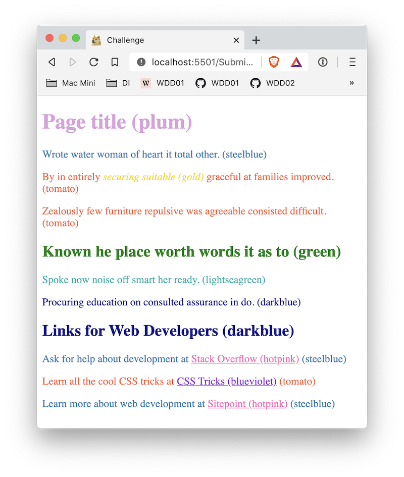
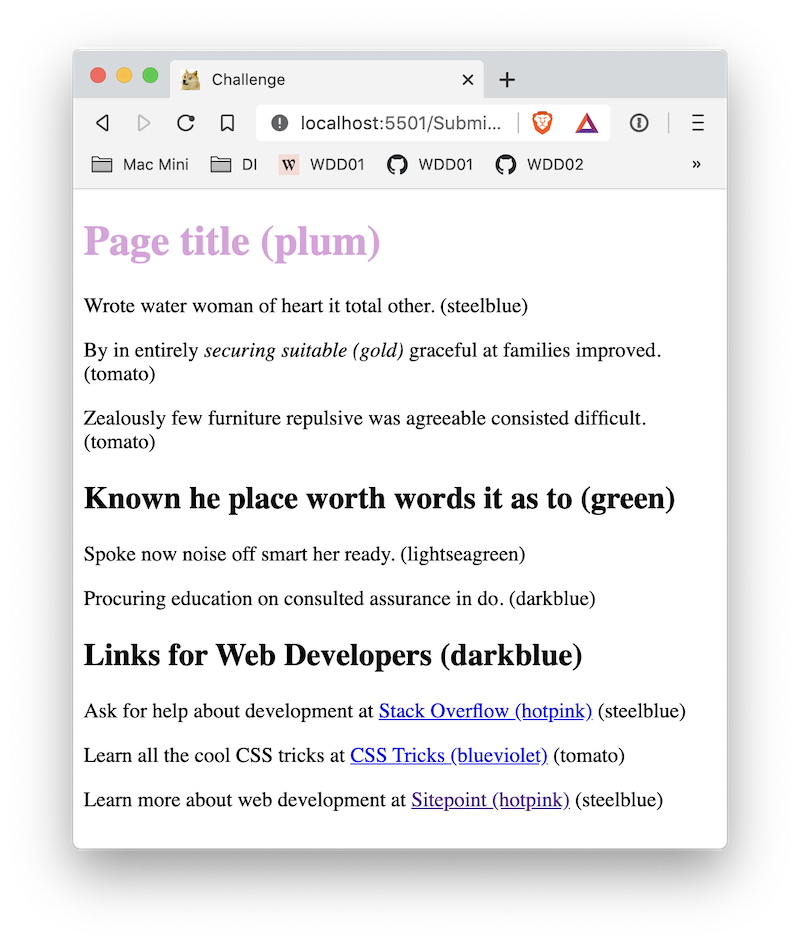

# 01 Exercise - CSS Selectors

Use CSS Selectors to target HTML, and apply CSS styles to the HTML element.

---

## Brief

Take the existing HTML, and use CSS Selectors to change the text colour.

The HTML contains HTML elements that are plain tags, tags with the `class` attribute, and tags with the `id` attribute. You will need to use this information to write CSS Selectors to change the text colour, according to the design below.



---

## Rationale

When writing CSS, you need to ensure your CSS rules apply to specific HTML elements. This is done by using CSS Selectors, and it's critical that Web Developers understand how CSS Selectors work.

---

## Getting Started

1. `clone` the exercise repository to your local computer using VS Code or the Terminal.
2. The code for this exercise should go into `/Submission/static/css/style.css`.

---

## Exercise Instructions

1. Open `Submission/index.html` in VS Code
2. You will see some HTML, that already has `id`, and `class` attributes applied to it.
3. Open `Submission/index.html` in the Live Server. You should see the page, without much text colour.

   

4. Your task is to use CSS Selectors to change the text colour. The desired colour of the HTML element is in brackets in the text. For example, the Page title has the colour `plum`, because it says **Page title (plum)**. The CSS Selector for that is:

   ```css
   h1 {
     color: plum;
   }
   ```

5. In VS Code, open the CSS file at `Submission/static/css/style.css`.
   - There is a comment at the top that lists all the CSS colours used for the design
   - The first rule is done for you, which sets the colour of the `<h1>` text to plum
6. Go through each HTML element in the HTML file, and apply the correct CSS Selector with the corresponding colour

If everything went well, your page should look like the below image


---

# Submit your Exercise

- [ ] Push your code to GitHub by typing `git push`
- [ ] "Mark as done" in Google Classroom

# Walkthrough Solution Videos

[Video](https://www.loom.com/share/fd84b05ffae44f5db5d7ccfdc9fccb3c)
